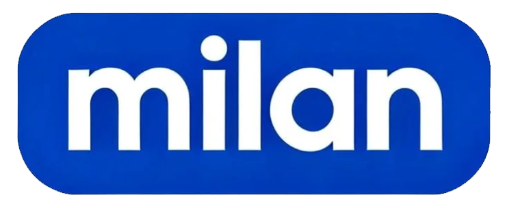

# Milan Tech 网页设计架构指南

> 本文档用于指导后续 AI 代码撰写工具进行网站改造优化

---

## 1. 项目概述

### 1.1 项目定位
- **品牌**: Milan Tech (觅蓝科技)
- **领域**: 智慧渔业 / 水产养殖智能化
- **核心价值**: 场景驱动的渔业 AIOT 网络，提供从决策到执行的闭环智能生态系统

### 1.2 页面结构
```
网站结构
├── index.html          # 主页面（首页）- 深色主题
└── AquaClaw-detail.html # 产品详情页 - 浅色主题
```

---

## 2. 技术栈

### 2.1 核心技术
| 技术 | 用途 | CDN/来源 |
|------|------|----------|
| HTML5 | 页面结构 | - |
| Tailwind CSS | 原子化样式框架 | `https://cdn.tailwindcss.com` |
| Three.js | 3D 粒子背景动画 | `https://cdnjs.cloudflare.com/ajax/libs/three.js/r128/three.min.js` |
| 原生 JavaScript | 交互逻辑 | 内联脚本 |

### 2.2 字体资源
```html
<!-- Google Fonts -->
Inter:wght@300;400;500;600;700
Noto Sans SC:wght@300;400;500;700
```

### 2.3 字体栈
```css
font-family: 'Inter', 'Noto Sans SC', sans-serif;
```

---

## 3. 设计系统

### 3.1 颜色方案

#### 深色主题 (index.html)
| 颜色名称 | 色值 | 用途 |
|----------|------|------|
| 深海深蓝 | `#0f172a` | 主背景色 |
| 海蓝 | `#1e3a5f` | 渐变中间色 |
|  slate-900 | `#0f172a` | 页面背景 |
|  slate-800 | `#1e293b` | 卡片背景 |
| 青绿 | `#34d399` | 强调色、成功状态 |
| 天蓝 | `#60a5fa` | 渐变文字、链接 |
| 青色 | `#0891b2` | 按钮、交互元素 |
| 水鸭色 | `#14b8a6` | 品牌色 |

#### 浅色主题 (AquaClaw-detail.html)
| 颜色名称 | 色值 | 用途 |
|----------|------|------|
| 淡天蓝 | `#f0f9ff` | 页面背景渐变起始 |
| 浅水蓝 | `#e0f2fe` | 页面背景渐变中间 |
| slate-800 | `#1e293b` | 主文字颜色 |
| teal-600 | `#0d9488` | 主强调色 |
| cyan-100 | `#cffafe` | 高亮框背景 |

### 3.2 核心 CSS 组件

#### 玻璃态效果 (Glassmorphism)
```css
/* 基础玻璃态 */
.glass {
    background: rgba(255, 255, 255, 0.05);
    backdrop-filter: blur(10px);
    border: 1px solid rgba(255, 255, 255, 0.1);
}

/* 卡片玻璃态 */
.glass-card {
    background: rgba(30, 58, 95, 0.3);
    backdrop-filter: blur(20px);
    border: 1px solid rgba(255, 255, 255, 0.1);
    transition: all 0.4s cubic-bezier(0.4, 0, 0.2, 1);
}

.glass-card:hover {
    background: rgba(30, 58, 95, 0.5);
    border-color: rgba(56, 189, 248, 0.5);
    transform: translateY(-5px);
    box-shadow: 0 20px 40px rgba(0, 0, 0, 0.4);
}
```

#### 渐变文字
```css
.text-gradient {
    background: linear-gradient(135deg, #60a5fa 0%, #34d399 100%);
    -webkit-background-clip: text;
    -webkit-text-fill-color: transparent;
    background-clip: text;
}
```

#### 深海渐变背景
```css
.ocean-gradient {
    background: linear-gradient(135deg, #0f172a 0%, #1e3a5f 50%, #0f172a 100%);
    background-size: 400% 400%;
    animation: oceanFlow 15s ease infinite;
}
```

#### 网格背景
```css
.grid-bg {
    background-image: 
        linear-gradient(rgba(255, 255, 255, 0.03) 1px, transparent 1px),
        linear-gradient(90deg, rgba(255, 255, 255, 0.03) 1px, transparent 1px);
    background-size: 50px 50px;
}
```

### 3.3 动画系统

| 动画名称 | 用途 | 时长 | 缓动函数 |
|----------|------|------|----------|
| `oceanFlow` | 背景渐变流动 | 15s | ease infinite |
| `float` | Hero 标题浮动 | 6s | ease-in-out infinite |
| `pulse-glow` | 元素脉冲光晕 | 3s | ease-in-out infinite |
| `reveal` | 滚动显示元素 | 0.8s | ease-out |
| `drawLine` | SVG 线条绘制 | 3s | ease-out |

### 3.4 响应式断点
```css
/* Tailwind 默认断点 */
sm: 640px   /* 小屏手机 */
md: 768px   /* 平板 */
lg: 1024px  /* 笔记本 */
xl: 1280px  /* 桌面 */
2xl: 1536px /* 大屏 */
```

---

## 4. 页面架构

### 4.1 index.html 页面结构

```
index.html
├── Head
│   ├── Meta 标签
│   ├── Tailwind CSS CDN
│   ├── Three.js CDN
│   └── 自定义样式 (<style>)
├── Body (bg-slate-900, text-white)
│   ├── Navigation (fixed, glass)
│   │   ├── Logo (点击回到顶部)
│   │   ├── 导航链接 (平滑滚动)
│   │   └── CTA 按钮
│   ├── Hero Section (ocean-gradient)
│   │   ├── Three.js 粒子画布
│   │   ├── 主标题 (animate-float)
│   │   ├── 副标题
│   │   ├── CTA 按钮组
│   │   ├── 核心数据展示 (4列网格)
│   │   └── 滚动指示器
│   ├── Products Section (grid-bg)
│   │   ├── 产品网格 (3列)
│   │   │   ├── 养殖智能体-AquaClaw (带模态窗口)
│   │   │   ├── 渔业知识图谱
│   │   │   ├── 智慧渔业 ERP
│   │   │   ├── 声光监测体系
│   │   │   ├── 投饵机器人
│   │   │   └── 巡检机器人
│   ├── Technology Section
│   │   ├── 云端大脑
│   │   ├── 边缘计算
│   │   └── 端设备 (3列网格)
│   ├── Solutions Section
│   │   ├── 鱼类智慧养殖决策体系
│   │   └── 智能养殖巡检管理
│   ├── CTA Section
│   ├── Footer
│   └── Modal (AquaClaw 详情弹窗)
└── Scripts
    ├── 模态窗口控制
    ├── 导航栏滚动效果
    ├── IntersectionObserver 滚动动画
    └── Three.js 粒子系统
```

### 4.2 AquaClaw-detail.html 页面结构

```
AquaClaw-detail.html
├── Head
│   ├── Meta 标签
│   ├── Tailwind CSS CDN
│   └── 自定义样式 (浅色主题)
├── Body (浅蓝渐变背景)
│   ├── Header (glass-header, fixed)
│   │   ├── 返回首页链接
│   │   └── Logo
│   ├── Main
│   │   ├── 标题区
│   │   ├── 视频展示区
│   │   ├── 技术概述
│   │   ├── 功能特性 (feature-item)
│   │   ├── 技术规格 (tech-spec 网格)
│   │   ├── 应用场景 (步骤编号)
│   │   ├── 客户案例
│   │   └── 联系我们
│   └── Footer
└── Scripts
    └── 导航栏阴影效果
```

---

## 5. 组件规范

### 5.1 导航栏
```html
<nav class="fixed w-full z-50 glass border-b border-white/10 transition-all duration-300" id="navbar">
    <div class="max-w-7xl mx-auto px-4 sm:px-6 lg:px-8">
        <div class="flex justify-between items-center h-20">
            <!-- Logo -->
            <div class="flex items-center space-x-3 cursor-pointer" onclick="window.scrollTo({top: 0, behavior: 'smooth'})">
                
                <span class="text-2xl font-bold tracking-tight">ML<span class="text-teal-400">Tech</span></span>
            </div>
            <!-- 导航链接 -->
            <div class="hidden md:flex space-x-8 text-xl">
                <a href="#products" onclick="event.preventDefault(); document.getElementById('products').scrollIntoView({behavior: 'smooth'})" class="text-slate-300 hover:text-teal-400 transition-colors font-medium cursor-pointer">产品矩阵</a>
                <!-- 其他链接... -->
            </div>
            <!-- CTA 按钮 -->
        </div>
    </div>
</nav>
```

### 5.2 产品卡片
```html
<div class="glass-card rounded-2xl p-8 reveal group cursor-pointer" onclick="openModal()">
    <div class="w-14 h-14 rounded-xl bg-cyan-500/20 flex items-center justify-center mb-6 icon-glow group-hover:scale-110 transition-transform">
        <!-- SVG Icon -->
    </div>
    <h3 class="text-xl font-bold mb-3 text-white">产品名称</h3>
    <p class="text-slate-400 mb-4 text-sm leading-relaxed">产品描述...</p>
    <div class="flex flex-wrap gap-2">
        <span class="px-3 py-1 bg-cyan-500/10 text-cyan-300 rounded-full text-xs">标签1</span>
    </div>
</div>
```

### 5.3 按钮样式

#### 主按钮（渐变）
```html
<button class="bg-gradient-to-r from-blue-600 to-teal-500 text-white px-8 py-4 rounded-full font-semibold text-lg transition-all transform hover:scale-105 shadow-xl shadow-blue-500/30">
    按钮文字
</button>
```

#### 次要按钮（玻璃态）
```html
<button class="glass text-white px-8 py-4 rounded-full font-semibold text-lg hover:bg-white/10 transition-all border border-white/20">
    按钮文字
</button>
```

### 5.4 模态窗口
```html
<div class="modal-overlay" id="ModalId" onclick="closeModal(event)">
    <div class="modal-content" onclick="event.stopPropagation()">
        <div class="modal-header">
            <h3 class="modal-title">标题</h3>
            <button class="modal-close" onclick="closeModal()">...</button>
        </div>
        <div class="modal-body">...</div>
    </div>
</div>
```

---

## 6. JavaScript 功能模块

### 6.1 模态窗口控制
```javascript
function openModal() {
    const modal = document.getElementById('ModalId');
    modal.classList.add('active');
    document.body.style.overflow = 'hidden';
}

function closeModal(event) {
    if (!event || event.target.id === 'ModalId' || event.target.closest('.modal-close')) {
        const modal = document.getElementById('ModalId');
        modal.classList.remove('active');
        document.body.style.overflow = '';
        // 暂停视频
        const video = modal.querySelector('video');
        if (video) video.pause();
    }
}

// ESC 键关闭
document.addEventListener('keydown', (e) => {
    if (e.key === 'Escape') closeModal();
});
```

### 6.2 导航栏滚动效果
```javascript
window.addEventListener('scroll', () => {
    const navbar = document.getElementById('navbar');
    if (window.scrollY > 50) {
        navbar.classList.add('glass', 'shadow-lg');
        navbar.classList.remove('bg-transparent');
    } else {
        navbar.classList.remove('glass', 'shadow-lg');
        navbar.classList.add('bg-transparent');
    }
});
```

### 6.3 滚动显示动画 (IntersectionObserver)
```javascript
const observerOptions = {
    threshold: 0.1,
    rootMargin: '0px 0px -50px 0px'
};

const observer = new IntersectionObserver((entries) => {
    entries.forEach(entry => {
        if (entry.isIntersecting) {
            entry.target.classList.add('active');
        }
    });
}, observerOptions);

document.querySelectorAll('.reveal').forEach(el => observer.observe(el));
```

### 6.4 Three.js 粒子背景
```javascript
// 基础配置
const scene = new THREE.Scene();
const camera = new THREE.PerspectiveCamera(75, window.innerWidth / window.innerHeight, 0.1, 1000);
const renderer = new THREE.WebGLRenderer({ alpha: true, antialias: true });

// 粒子数量
const particlesCount = 800;

// 鼠标交互
let mouseX = 0;
let mouseY = 0;
document.addEventListener('mousemove', (event) => {
    mouseX = (event.clientX / window.innerWidth) * 2 - 1;
    mouseY = -(event.clientY / window.innerHeight) * 2 + 1;
});

// 响应式
window.addEventListener('resize', () => {
    camera.aspect = window.innerWidth / window.innerHeight;
    camera.updateProjectionMatrix();
    renderer.setSize(window.innerWidth, window.innerHeight);
});
```

---

## 7. 图片/视频资源规范

### 7.1 资源目录结构
```
assets/
├── logo-en.png              # 英文 Logo
├── ftd-cover.png            # 视频封面
└── fish-tracking-demo-01.mp4 # 演示视频
```

### 7.2 视频播放器配置
```html
<video controls poster="./assets/ftd-cover.png">
    <source src="./assets/fish-tracking-demo-01.mp4" type="video/mp4">
    <!-- 备用在线视频 -->
    <source src="https://www.w3schools.com/html/mov_bbb.mp4" type="video/mp4">
    您的浏览器不支持视频播放。
</video>
```

---

## 8. 开发规范

### 8.1 HTML 规范
- 使用语义化标签 (`<nav>`, `<main>`, `<section>`, `<footer>`)
- 所有 `id` 使用小写字母和连字符（如 `id="products"`）
- 图片必须包含 `alt` 属性
- 外链使用 `target="_blank"` (通过 base 标签统一设置)

### 8.2 CSS 规范
- 优先使用 Tailwind 类名
- 自定义样式使用语义化类名（如 `.glass-card` 而非 `.card-1`）
- 动画使用 `transform` 和 `opacity` 以启用 GPU 加速
- 颜色值使用 Tailwind 色板或 CSS 变量

### 8.3 JavaScript 规范
- 使用原生 JavaScript（不依赖 jQuery）
- 事件处理函数命名清晰（如 `openModal`, `closeModal`）
- 添加必要的注释说明功能

---

## 9. 扩展建议

### 9.1 可优化方向
1. **性能优化**
   - 使用 WebP 格式图片
   - 懒加载非首屏图片
   - Three.js 粒子数根据设备性能动态调整

2. **SEO 优化**
   - 添加 Open Graph 标签
   - 完善 meta description
   - 添加结构化数据 (JSON-LD)

3. **无障碍优化**
   - 添加 ARIA 标签
   - 确保键盘可访问性
   - 提高颜色对比度

4. **功能扩展**
   - 多语言支持 (i18n)
   - 深色/浅色主题切换
   - 产品详情页模板化

### 9.2 新增页面建议
```
建议新增页面
├── products/               # 产品系列页面
│   ├── aquaclaw.html
│   ├── knowledge-graph.html
│   └── ...
├── solutions/              # 解决方案详情
│   ├── fish-farming.html
│   └── crab-farming.html
├── cases/                  # 客户案例
├── about/                  # 关于我们
└── contact/                # 联系方式
```

---

## 10. 快速参考

### 10.1 常用 Tailwind 类组合

| 效果 | 类名组合 |
|------|----------|
| 玻璃态卡片 | `glass-card rounded-2xl p-8 reveal group` |
| 渐变按钮 | `bg-gradient-to-r from-blue-600 to-teal-500 text-white px-8 py-4 rounded-full font-semibold hover:scale-105 transition-all` |
| 图标容器 | `w-14 h-14 rounded-xl bg-cyan-500/20 flex items-center justify-center icon-glow` |
| 标签 | `px-3 py-1 bg-cyan-500/10 text-cyan-300 rounded-full text-xs` |
| Section 标题 | `text-4xl font-bold mb-4` |
| Section 副标题 | `text-slate-400 text-lg` |

### 10.2 SVG 图标规范
- 使用 `fill="none" stroke="currentColor"` 实现颜色继承
- 统一 `viewBox="0 0 24 24"`
- 统一 `stroke-width="2"`

## 11.优化建议
### 11.1 性能优化
优化Three.js粒子系统性能：
- 当前使用800粒子BufferGeometry
- 目标：支持3000+粒子且保持60fps
- 要求：使用ShaderMaterial在GPU端计算位置更新
- 参考最佳实践：使用InstancedMesh和视锥体剔除
- 保持现有视觉风格（青蓝色粒子，鼠标跟随）
### 11.2 添加新页面
基于现有设计系统，创建"关于我们"页面：
- 使用相同的技术栈（Tailwind+原生JS）
- 保持一致的色彩系统（深海蓝渐变背景）
- 包含：团队介绍时间轴、企业价值观卡片、联系表单
- 复用现有组件：glass-card、gradient-text、reveal动画
- 导航栏链接指向：index.html#about
### 11.3 响应修复
修复当前移动端显示问题：
- 问题：Hero区域在部分手机被导航栏遮挡
- 当前使用：pt-28 md:pt-32 和 h-screen
- 要求：使用dvh单位或调整padding计算
- 确保iOS Safari底部安全区域适配（env(safe-area-inset-bottom)）
### 11.4 组件抽象
将以下HTML组件抽象为可复用结构：
- 玻璃卡片（glass-card）
- 带图标的产品卡片
- 模态窗口
要求：
- 使用CVA (Class Variance Authority)管理变体[^16^]
- 定义明确的Props接口：variant, size, color
- 使用tailwind-merge处理类名冲突[^24^]
- 输出TypeScript类型定义


---

*文档生成时间: 2026-03-18*  
*适用于: Milan Tech 智慧渔业官网*
